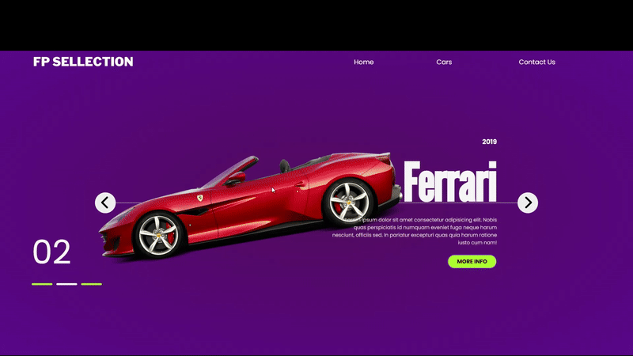

Bem-vindo ao repositório do **FP Selection**! 🚗 Este é um projeto web simples e interativo que exibe uma seleção de carros de luxo com informações detalhadas.

---

## 🎯 Objetivo do Projeto

O objetivo do FP Selection é proporcionar uma interface elegante e responsiva para explorar modelos de carros, com descrições e imagens organizadas de forma interativa.

---

## 📸 Demonstração




---

## 🛠️ Tecnologias Utilizadas

- **HTML5**
- **CSS3**
- **JavaScript**
- **Google Fonts**

---

## 🚀 Como Executar o Projeto

1. Clone o repositório:
   ```bash
   git clone https://github.com/seu-usuario/fp-selection.git

2. Navegue até a pasta do projeto:
    cd fp-selection

3. Abra o arquivo index.html no seu navegador preferido.

## 🌟 Recursos do Projeto

Interface responsiva: Projetado para funcionar bem em diferentes dispositivos.
Navegação interativa: Use os botões de seta para navegar entre os modelos de carros.
Design elegante: Tipografia e cores cuidadosamente escolhidas para uma experiência visual agradável.


## 📬 Contato

Se tiver dúvidas ou sugestões, sinta-se à vontade para abrir uma issue ou enviar uma mensagem para:

Nome: Ana Claudia Romão
Email: ana270391@gmail.com
GitHub: anaromao01

